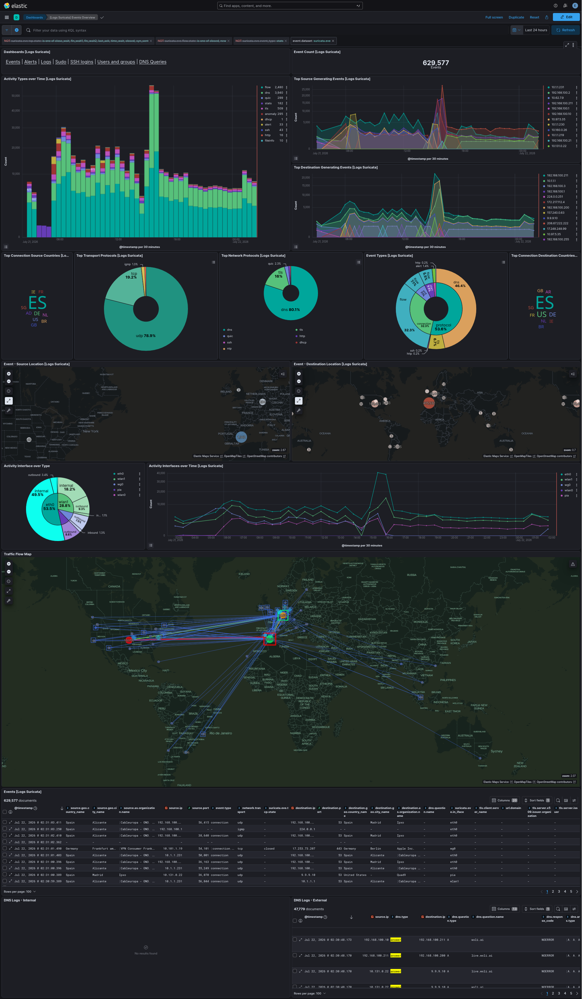
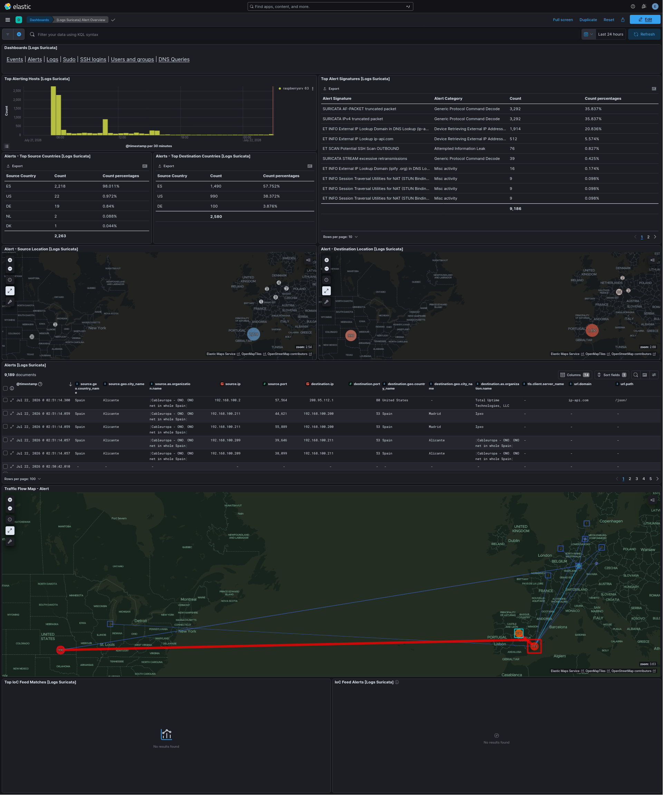
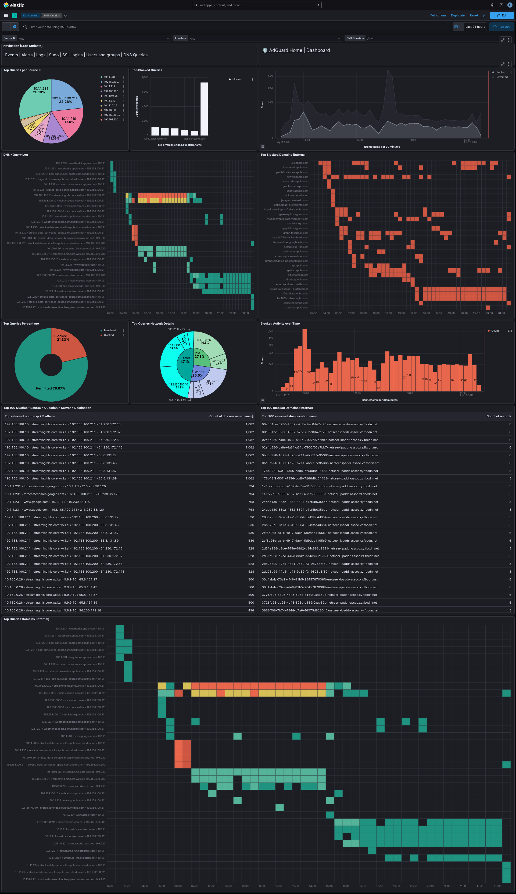
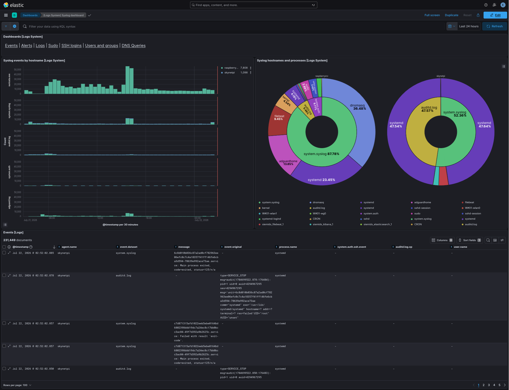
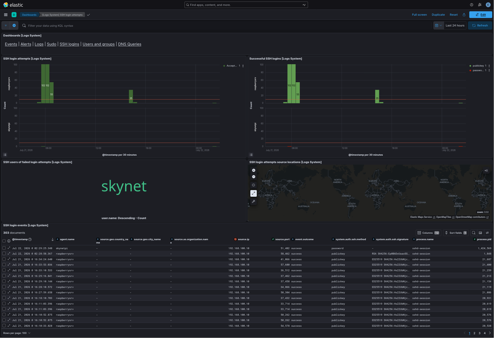
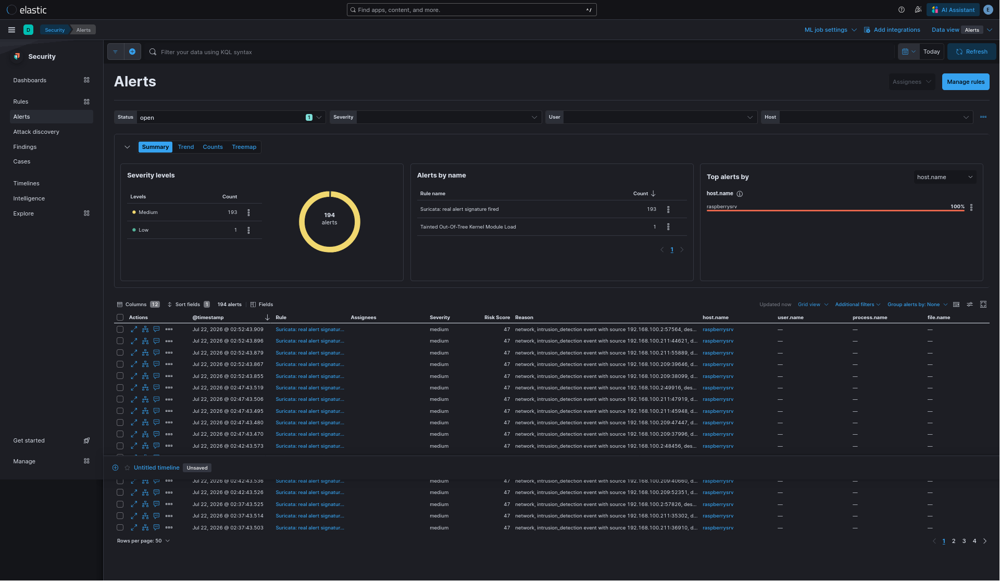
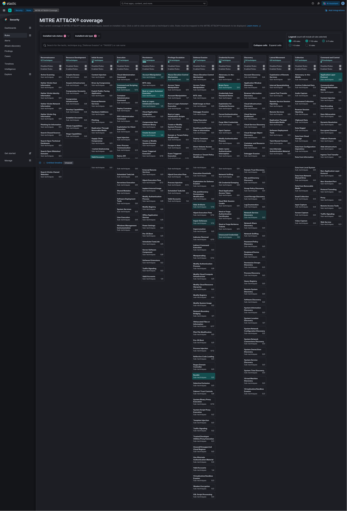

# Open Source 👁 SIEM-IDS Solution

**SIEM-IDS integrates open source tools to monitor, analyze, correlate, and alert on network traffic, systems, applications, and security events in real-time.** It combines Suricata's rule-/signature-based Intrusion Detection (IDS) with the Elastic Stack's centralized log aggregation, real-time correlation, and historical analysis -- giving actionable visibility into your network's privacy and security posture.

> *Disclaimer: This is currently in development and is safe to run in a staging environment or as a demo. However, it is not recommended for production use due to incomplete features, such as partial integration with the OTX API | Threat Intelligence feature.*

## OpenSource Components

### [Suricata](https://github.com/OISF/suricata) | [Elasticsearch](https://github.com/elastic/elasticsearch) | [Kibana](https://github.com/elastic/kibana) | [Filebeat](https://github.com/elastic/beats/tree/main/filebeat) | [AdGuard Home](https://github.com/AdguardTeam/AdGuardHome) | [OTX API](https://otx.alienvault.com/)

- **Suricata**: a Network Intrusion Detection/Prevention System (IDS/IPS) and Network Security Monitoring (NSM) engine -- captures and inspects network traffic, logging alerts as EVE JSON.
- **Filebeat**: ships and enriches Suricata's EVE logs to Elasticsearch. It also collects and forwards *auditd*, *auth.log*, *syslog*, and [AdGuard Home](https://github.com/AdguardTeam/AdGuardHome)'s DNS query log -- the local DNS server this project actually uses.
- **Elasticsearch**: stores and indexes every event Filebeat ships, powering correlation and historical search.
- **Kibana**: the dashboards, saved visualizations, and Detection Engine (detection rules/alerting) built on top of Elasticsearch -- see [Detection Rules](#detection-rules) and [Screenshots](#screenshots).
- **AdGuard Home**: the DNS server/ad-blocker actually run in this deployment; its query log is one of Filebeat's inputs and powers the [DNS Queries](#screenshots) dashboard.
- **OTX API** *(under development)*: optional AlienVault threat-intel IP lookups via a small local Flask API -- see [OTX Open Threat Exchange](#otx-open-threat-exchange-under-development).

## Index

1. [OpenSource Components](#opensource-components)
2. [Architecture](#architecture) (two devices: ELK host + Suricata sensor)
3. [Setup Instructions](#setup-instructions) (clone the repo, install Podman)
4. [Configure Suricata](#configure-suricata)
5. [Getting started](#getting-started) (Device A: the ELK host)
   - [Podman Compose Configuration](#podman-compose-configuration)
   - [Podman Container Security](#podman-container-security)
   - [ELK Configuration and Objects](#elk-configuration-and-objects)
   - [Detection Rules](#detection-rules)
   - [ELK Passwords and Secrets](#elk-passwords-and-secrets)
   - [Filebeat Log Collection and Enrichment](#filebeat-log-collection-and-enrichment)
6. [Ready to start](#ready-to-start) (Device A)
7. [Device B: Suricata Sensor (e.g. a Raspberry Pi router)](#device-b-suricata-sensor-eg-a-raspberry-pi-router)
8. [Traffic Flow Map](#traffic-flow-map)
9. [OTX Open Threat Exchange (under development)](#otx-open-threat-exchange-under-development)
10. [Screenshots](#screenshots)
11. [Contributing](#contributing)
12. [License](#license)

## Architecture

**This project deploys across two devices**: **Device A** runs the full ELK stack
(Elasticsearch, Kibana, Filebeat) via `podman-compose` -- it needs real RAM for
Elasticsearch. **Device B** runs Suricata natively (a router/AP-class box, e.g. a
Raspberry Pi, is enough) and ships its logs to Device A over the LAN. There's no
supported single-device (everything-on-one-host) setup -- Elasticsearch and Suricata
on the same box is more than most small hardware can handle, and it isn't what this
project is tested against.

The steps below (through [Ready to start](#ready-to-start)) set up **Device A first**
-- its TLS certs need to exist before Device B can connect -- then jump to
[Device B: Suricata Sensor](#device-b-suricata-sensor-eg-a-raspberry-pi-router) to
bring up the second device.

## Setup Instructions

1. **Clone the Repository**:
   ```bash
   git clone https://github.com/virtueistheonlygood/siemids
   cd siemids
   cp .env.example .env
   ```
   `.env` is git-ignored -- `start.sh` writes real, randomly-generated passwords and
   Kibana's encryption key into it on first run, so it must never be committed. Only
   `.env.example` (a secret-free template) is tracked.

2. **Install Podman and podman-compose**:
   - Follow the installation instructions on the [Podman website](https://podman.io/getting-started/installation) and the [podman-compose GitHub repository](https://github.com/containers/podman-compose).

## Configure Suricata

**This project runs Suricata natively, not as a container, and always on Device B** (the sensor) -- see [Device B: Suricata Sensor](#device-b-suricata-sensor-eg-a-raspberry-pi-router) for the full deployment steps; this section covers the config file itself. Install it per the [Suricata documentation](https://suricata.readthedocs.io/en/latest/install.html), then tailor the config to your topology -- start from the stock sample `resources/suricata/suricata.yaml`, or `resources/suricata/suricata-raspberrysrv.yaml` for a fully populated, real-world multi-interface example.

Key configuration aspects include:

1. **Network Interfaces**: Specify the network interfaces that Suricata should monitor for traffic analysis. `threads: auto` resolves to "number of cores" *per interface* -- on a small, multi-purpose box (router/AP also running DNS, VPN, NAT), that can quickly oversubscribe the CPU with several interfaces defined; consider hardcoding a low, deliberate thread count per interface instead, as done here:

  ```yaml
  af-packet:
    - interface: wlan0
      threads: 1
      cluster-id: 99
      cluster-type: cluster_flow
      defrag: yes
      use-mmap: yes
      mmap-locked: yes
      tpacket-v3: yes
      ring-size: 2048
      block-size: 32768
      block-timeout: 10
      use-emergency-flush: yes
      buffer-size: 32768
      disable-promisc: no
      checksum-checks: kernel

    - interface: wg0
      threads: 1
      cluster-id: 98
      cluster-type: cluster_flow
      defrag: yes
      use-mmap: yes
      mmap-locked: yes
      tpacket-v3: yes
      ring-size: 2048
      block-size: 32768
      block-timeout: 10
      use-emergency-flush: yes
      buffer-size: 32768
      disable-promisc: no
      checksum-checks: kernel

    # Values used for any interface not explicitly listed above.
    - interface: default
  ```

2. **Rule Sets**: Specify the rule sets that Suricata should use to detect threats.

  ```yaml
  default-rule-path: /usr/local/var/lib/suricata/rules

  rule-files:
    - suricata.rules
  ```

3. **Logging**: Configure logging options to capture and store alerts and other relevant data. This is the path Filebeat collects Suricata EVE logs from.

  ```yaml
  default-log-dir: /suricata/
  ```

## Getting started

### Podman Compose Configuration

The `podman-compose.yaml` file orchestrates the deployment of the various services needed. It specifies the configuration for each service, including security, network settings, environment variables, and volume mounts, ensuring a seamless integration of all components.

### Podman Container Security

Communication between the containerized services (Elasticsearch, Filebeat, and Kibana) is secured using HTTPS/SSL, with a PKI generated on first run by the `setup_pki` service.
  ```yaml
  setup_pki:
    image: docker.elastic.co/elasticsearch/elasticsearch:${STACK_VERSION}
    volumes:
      - ./certs:/usr/share/elasticsearch/config/certs
    user: "0"
  ```
  - **The certificates used for securing communication between containerized services are stored under the `certs/` directory**.
  - The `elasticsearch` cert's SAN list includes `ELK_LAN_IP` (set in `.env`, defaults to this host's LAN IP) in addition to `elasticsearch`/`localhost`/`127.0.0.1`, so remote Beats agents (e.g. the [Device B: Suricata Sensor](#device-b-suricata-sensor-eg-a-raspberry-pi-router)) connecting by LAN IP get full TLS hostname verification instead of failing on IP mismatch. This only takes effect on first cert generation -- if certs already exist and `ELK_LAN_IP` changes, delete `certs/` and rerun `./start.sh`.

### ELK Configuration and Objects

The visualizations and dashboards are stored in `saved.objects/siemids.ndjson` and
**imported automatically** as part of `./start.sh`/`podman-compose up -d` -- no manual
step needed. This is done by a dedicated one-shot service, `setup_kibana`, which:

1. Waits for the `kibana` service's healthcheck (`depends_on: kibana: condition:
   service_healthy`) before starting at all.
2. Polls `https://localhost:5601` in a loop until it gets back `HTTP/1.1 302 Found`
   (Kibana's redirect-to-login, meaning the HTTP server itself is actually accepting
   requests, not just that the container process is running).
3. `POST`s `saved.objects/siemids.ndjson` to Kibana's `/api/saved_objects/_import`
   endpoint (`compatibilityMode=true` lets objects exported from a slightly different
   Kibana version still import cleanly), authenticating as `elastic` via `ELASTIC_PASSWORD`.
4. Exits. Being `restart: on-failure` rather than `restart: always`, it only reruns if
   step 2/3 actually failed -- a normal successful import doesn't loop or reimport on
   every subsequent `start.sh` run.

  (see the `setup_kibana` service in `podman-compose.yaml` for the exact commands)

- **Configuration files are located in `resources/` directory**

The `[Logs Suricata] Alert Overview` dashboard includes a `Top IoC Feed Matches`
panel (backed by the `IoC Feed Alerts [Logs Suricata]` saved search) that isolates
hits matching the curated IoC feeds specifically -- filtering on
`rule.name: SSLBL* or rule.name: "ET CNC Feodo Tracker*" or rule.name: "ETN AGGRESSIVE*"`
-- broken down by which indicator fired and which host triggered it, separate from the
general "Top Alert Signatures" table where these would otherwise be buried among
thousands of ET/Open matches. The dedicated `siemids-suricata-ioc-feed-match` detection
rule (see [Detection Rules](#detection-rules)) uses the same filter. See
[Device B: Suricata Sensor](#device-b-suricata-sensor-eg-a-raspberry-pi-router) for how
those feeds get enabled.

### Detection Rules

`saved.objects/detection-rules.ndjson` ships 25 curated detection rules, split between
14 adapted from [Elastic's free prebuilt rule catalog](https://www.elastic.co/guide/en/security/current/prebuilt-rules.html)
(`elastic-*` rule IDs) and 11 authored specifically for this project's actual log
sources and observed noise patterns (`siemids-*` rule IDs) -- every rule is mapped to
its [MITRE ATT&CK](https://attack.mitre.org/) tactic/technique.

| Category | Rules |
| --- | --- |
| **SSH / Credential Access** | Brute-force (internal/external/successful, both a custom threshold rule and Elastic's EQL variants), direct root login, first-seen source IP, unusual user or SSH public key |
| **Privilege escalation / `sudo` misuse** | `sudo` spawning an interactive shell (`sudo bash`/`su`), `sudo` touching `/etc/passwd`, `/etc/shadow`, `/etc/sudoers`, or account-management commands |
| **Persistence / account & system changes** | New Linux user/group creation, manual `iptables` firewall changes (excluding normal Podman/netavark churn), suspicious `rc.local` errors |
| **Kernel integrity** | Tainted or out-of-tree kernel module loads, executable-stack process starts, suspicious `bpf_probe_write_user` usage |
| **Command and control** | AdGuard blocked-query spike from one client (beaconing indicator), Cobalt Strike's default team-server TLS certificate, **Suricata IoC feed match** (`siemids-suricata-ioc-feed-match` -- fires specifically on Feodo Tracker/SSLBL indicator hits, high severity, separate from the generic Suricata rule below since a confirmed-bad indicator match deserves different priority than a heuristic signature match) |
| **Network (Suricata)** | Any real Suricata alert signature (tuned to exclude two known decoder-noise signatures), potential outbound SSH scans (tuned to exclude this project's own admin/automation hosts) |

Several of the custom rules are tuned against noise this deployment actually generates
(e.g. the firewall-change rule excludes routine Podman/netavark churn). **These are a
starting point, not exhaustive**: review them against your own log sources and threat
model, retune the noise-exclusions, and add rules for your environment.

Unlike dashboards, rules are **not** auto-imported by any compose service -- the
Detection Engine's backing indices only initialize once the Security app has been
opened at least once, which would race against `setup_kibana`'s startup-time import.
Import them yourself, once, after Kibana is up:

  ```bash
  curl -sk -u elastic:<ELASTIC_PASSWORD> -X POST \
    "https://localhost:5601/api/detection_engine/rules/_import?overwrite=true" \
    -H "kbn-xsrf: true" \
    --form file=@saved.objects/detection-rules.ndjson
  ```

  A successful import reports `"success":true,"success_count":24,"errors":[]`. Rules
  are enabled on import; verify in **Security → Rules**, or via:

  ```bash
  curl -sk -u elastic:<ELASTIC_PASSWORD> \
    "https://localhost:5601/api/detection_engine/rules/_find?per_page=100" \
    -H "kbn-xsrf: true"
  ```

### ELK Passwords and Secrets

`start.sh` generates `ELASTIC_PASSWORD`, `KIBANA_PASSWORD`, and `KIBANA_ENCRYPTION_KEY`
on first run only, storing the passwords as both Podman secrets and lines appended to
`.env`, and the encryption key as an `.env` line consumed via
`XPACK_SECURITY_ENCRYPTIONKEY`/`XPACK_ENCRYPTEDSAVEDOBJECTS_ENCRYPTIONKEY`/
`XPACK_REPORTING_ENCRYPTIONKEY` env vars (Kibana's docker entrypoint converts these into
the equivalent `kibana.yml` settings). All three must stay stable across restarts --
Elasticsearch only honors the password at first-ever cluster bootstrap, and Kibana can't
decrypt previously-encrypted saved objects (e.g. stored connector credentials) if the
key changes -- so re-running `start.sh` reuses the existing secrets instead of
regenerating them. Use the `ELASTIC_PASSWORD` to log in at https://localhost:5601.

**`.env` is git-ignored precisely because of this** -- it holds real, live secrets once
`start.sh` has run. Never `git add -f .env`, and never hardcode any of these three
values into a tracked file (an earlier version leaked a password/encryption-key
generation into git history this way). The passwords are also stored as Podman secrets
(`elastic_password`/`kibana_password`, consumed by `setup_pki`) -- see `start.sh` for
the exact generation/storage logic.

### Filebeat Log Collection and Enrichment

`resources/filebeat/filebeat-skynetpi.yml` is Device A's (the ELK host's) Filebeat
config, mounted by the `filebeat` service in `podman-compose.yaml`. Since Device A
isn't the network sensor in this topology, it's deliberately simple: no Suricata
module, no AdGuard input, no geo-enrichment processors, no `scripts/interfaces.py`
dependency -- it ships only Device A's own OS logs.

  ```bash
  nano resources/filebeat/filebeat-skynetpi.yml
  ```
System logs are collected from the standard path `/var/log`, including files such as *syslog*, *auth.log*, and *audit.log*.

  ```yaml
  filebeat.modules:
  - module: auditd
    log:
      enabled: true
      var.paths: ["/var/log/audit/audit.log*"]
  - module: system
    syslog:
      enabled: true
      var.paths: ["/var/log/syslog*"]
    auth:
      enabled: true
      var.paths: ["/var/log/auth.log*"]
  ```

Ensure that the Filebeat configuration, including file permissions, file paths,
processors, and fields, is properly set up to meet your environment's requirements.
Refer to the [official Filebeat documentation](https://www.elastic.co/guide/en/beats/filebeat/current/filebeat-configuration.html)
for additional details.

**Device B's Filebeat config is different and covered separately** -- it's the one
carrying the Suricata module, AdGuard input, and all the geo-enrichment processors
that power the Traffic Flow Map. See
[Device B: Suricata Sensor](#device-b-suricata-sensor-eg-a-raspberry-pi-router) below.

## Ready to start

`start.sh` brings up Device A (`podman-compose`) -- run it there once Device A's
Filebeat config above is set. It does not touch Device B at all; that has no
`podman-compose` and is deployed separately in the next section.

**Note**: Running the `start.sh` script will not affect your running containers, however it will clean your local environment from previous setups and set system parameters required for Elasticsearch on your host and change ownership and permissions of configuration files in `resources/`. This ensures that any previous configurations or data do not interfere with the new setup.
  ```bash
  sudo ./start.sh
  ```
**Yes, you need sudo to ensure that Podman has the necessary permissions.**

- Podman need elevated privileges to perform certain tasks, such as accessing network interfaces, binding to ports below 1024 and due the configuration of certain capabilities (e.g., NET_ADMIN), mounting directories and files that require root access.

## Device B: Suricata Sensor (e.g. a Raspberry Pi router)

Device B (a router/AP-class box, e.g. a Raspberry Pi -- too small to run Elasticsearch)
runs Suricata natively and ships its `eve.json` to Device A with a dedicated,
lightweight Filebeat instance. It has no `podman-compose`, so it's driven by plain
`podman run --restart=always` (see `scripts/*-podman.sh` for examples), not compose.
Device A must already be up before starting here -- these steps assume its TLS certs
already exist.

1. Build a `suricata.yaml` for the sensor host from `resources/suricata/suricata.yaml` (the stock sample) or `resources/suricata/suricata-raspberrysrv.yaml` (a concrete, fully populated multi-interface example), replacing the `af-packet` interface names with the sensor's real interfaces (its AP/LAN and VPN egress interfaces -- not its WAN uplink, unless you want that monitored too), keeping `default-log-dir: /suricata/`.
2. Enable/start it as a native systemd service (`suricata.service`, shipped by the distro package) -- see [Configure Suricata](#configure-suricata). Then run `scripts/suricata-update-timer-install.sh`, which:
   - Enables `et/open` (Emerging Threats Open, ~40k signatures) plus four free IoC feeds via `suricata-update enable-source`: `abuse.ch/feodotracker` (botnet C2 IPs), `abuse.ch/sslbl-blacklist`/`sslbl-ja3` (malicious TLS certs/JA3 fingerprints), and `etnetera/aggressive` (IP blacklist) -- together only a few hundred to ~10k lightweight rules, small next to `et/open`. **Enabling a source is one-time and additive** -- with zero sources enabled, `suricata-update` does *not* fall back to `et/open`, so skipping this step silently leaves the sensor with no real ruleset.
   - Pulls the rules immediately, then installs a daily-refresh systemd timer (`resources/suricata/suricata-update.service`/`.timer`, `05:00 UTC` + up to 30min random delay) that **live-reloads Suricata with no capture gap** via its `unix-command` socket.
3. Run `scripts/interfaces.py` **on the sensor host** first -- it generates the `geoip/*.json` and `env/*.env` files Device B's Filebeat geo-enrichment processors read from. Edit it to set `localnet_1`/`vpnet_1` (and `piavpn_1`, if the sensor has a second VPN egress like a PIA tunnel) to that host's actual interfaces:

  ```python
  localnet_1 = "eth0" # modify with your local (internet-facing) interface name
  vpnet_1 = "wg0" # modify with your vpn interface name
  #localnet_2 = "wlan1" # modify with your local interface name
  #vpnet_2 = "wg1" # modify with your vpn interface name

  # Second, separate VPN egress (e.g. a PIA tunnel used by a specific
  # container/service alongside the main vpnet_1 VPN). Comment out if not
  # applicable to your setup.
  piavpn_1 = "pia" # modify with your second vpn interface name
  ```

   `localnet_1` must be an interface with a **direct route to the internet** (it's used
   for the public-IP geo lookup) -- on a router/AP box, that's the WAN uplink, not an AP
   interface like `wlan0`/`wlan1` (client traffic on those is force-tunneled through the
   VPN and has no direct egress of its own). The AP subnets' local-IP matching in
   Filebeat's processors is separate, hardcoded IP-prefix logic and unaffected by this
   variable. *Naming the interfaces themselves is still a one-time manual step; keeping
   their enrichment current afterward is automated -- see below.*

   **Keeping this current automatically**: these interfaces' IPs can change on their own
   (WAN IP on DHCP renewal, `wg0`/`pia` tunnel IPs on VPN reconnect/rotation). Filebeat
   only reads `env/*.env` at container creation -- a plain restart does **not** reload
   them (see the Gotcha below) -- so stale enrichment would otherwise silently persist.
   `scripts/refresh-filebeat-enrichment.sh` automates the fix: re-run `interfaces.py`,
   diff the resulting `env/*.env`, and only recreate the Filebeat container (a brief
   capture gap) when something actually changed. Installed as a 5-minute systemd timer
   via `scripts/refresh-filebeat-enrichment-timer-install.sh`.
4. If the sensor doesn't already run `auditd`/`rsyslog` (e.g. a journald-only distro like Raspberry Pi OS), install and enable both -- `filebeat-<sensor>.yml`'s `auditd`/`system` modules need `/var/log/audit/audit.log`, `/var/log/syslog` and `/var/log/auth.log` to actually exist.
5. Copy `certs/ca/ca.crt` and `certs/filebeat/{filebeat.crt,filebeat.key}` from the ELK host (generated by its `setup_pki` service after the first `./start.sh` run) onto the sensor host. Set `ELK_LAN_IP` in the ELK host's `.env` to its real LAN IP *before* that first run -- see [Podman Container Security](#podman-container-security) -- otherwise the sensor's Filebeat will fail TLS hostname verification when connecting by IP.
6. Deploy a `resources/filebeat/filebeat-<sensor>.yml` via a `scripts/filebeat-<sensor>-podman.sh` script (see `resources/filebeat/filebeat-raspberrysrv.yml` / `scripts/filebeat-raspberrysrv-podman.sh` for a concrete example), pointing `ELASTICSEARCH_HOSTS` at the ELK host's LAN address and `ELASTICSEARCH_PASSWORD` at its `elastic_password` secret. Besides the `suricata` module, this instance also ships the sensor's own `auditd`/`system` (syslog+auth) logs and, if present, [AdGuard Home](https://github.com/AdguardTeam/AdGuardHome)'s JSON query log (tagged as its own `adguard.log` dataset).

Device A's own `filebeat` service is covered in
[Filebeat Log Collection and Enrichment](#filebeat-log-collection-and-enrichment) above
(`filebeat-skynetpi.yml` -- OS logs only, no Suricata/geo-enrichment). For a
memory-constrained Device A (e.g. also a Raspberry Pi 4B), use
`podman-compose-skynetpi.yaml` instead of `podman-compose.yaml`.

**Gotcha**: env files referenced by Device B's geo-enrichment processors (`${localnet_geo_*}` etc.) must be loaded as real container environment variables, not just bind-mounted as files -- use `podman run --env-file` when deploying Device B's Filebeat. A bind mount alone leaves those variables unresolved and Filebeat refuses to start.

## Traffic Flow Map

After completing the previous steps, we can now visualize network events using the custom visualizations created for this project. The **Logs Suricata Events Overview** dashboard combines activity-over-time, top source/destination breakdowns, protocol distribution, source/destination geo maps, per-interface activity (`eth0`/`wlan0`/`wlan1`/`wg0`/`pia`), and the Traffic Flow Map itself, highlighting connections and their source/destination countries in one view:



## OTX Open Threat Exchange (under development)

Add your [OTX AlienVault](https://otx.alienvault.com/) API_KEY to `resources/otx-api.py`

  ```bash
  API_KEY = 'YOUR_OTX_API_KEY'
  ```

To query the OTX API you can use tools like `curl` and `jq`. 
  ```bash
  curl "http://127.0.0.1:5000/threat_intel?ip=<IP_ADDRESS>" | jq .
  ```

Replace `<IP_ADDRESS>` with the IP address you want to query. For example:

  ```bash
  curl "http://127.0.0.1:5000/threat_intel?ip=8.8.8.8" | jq .
  ```

## Screenshots

**Suricata Alert Overview** — top alert signatures and categories, top alerting hosts over time, source/destination countries for alerting traffic, and a dedicated Traffic Flow Map scoped to alerts only:



**DNS Queries** — AdGuard Home integration: queries per source IP, top blocked domains, a permitted-vs-blocked query log timeline, and per-interface query breakdown:



**Syslog dashboard** — system events (`system.syslog`, `auditd.log`, `system.auth`) broken down by host and by process, across both Device A and Device B:



**SSH login attempts** — successful vs. failed logins over time per host, failed-attempt usernames, and source geolocation:



**Security Alerts** — Kibana's native detection-rule alerts (severity, risk score, rule name) generated from the Suricata signature feed:



**MITRE ATT&CK® Coverage** — which tactics/techniques the installed detection rules actually cover, at a glance:



## Contributing

Contributions are welcome! Please feel free to fork the repository and submit a pull request with your changes.

## License

This repository's own original content (configuration, scripts, documentation) is
licensed under the [MIT License](LICENSE).

It incorporates several third-party open-source components, each under its own license:

- Suricata: Licensed under the [GPLv2 License](https://github.com/OISF/suricata/blob/master/LICENSE).
- Elasticsearch: Licensed under the [Elastic License 2.0](https://www.elastic.co/licensing/elastic-license).
- Kibana: Licensed under the [Elastic License 2.0](https://www.elastic.co/licensing/elastic-license).
- Filebeat: Licensed under the [Elastic License 2.0](https://www.elastic.co/licensing/elastic-license).
- AdGuard Home: Licensed under the [GPLv3 License](https://github.com/AdguardTeam/AdGuardHome/blob/master/LICENSE.txt).

Please refer to the respective project's LICENSE file for more detailed information.